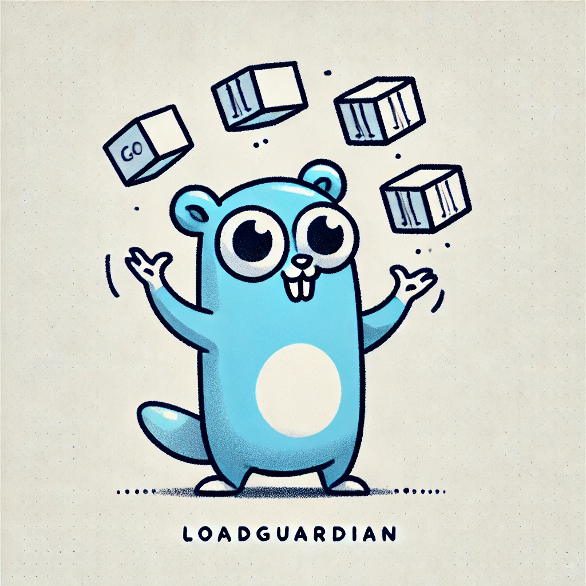

# LoadGuardian Service


LoadGuardian is a load balancer and monitoring service that distributes traffic across backend services using various algorithms like `roundrobin`, `random`, and `leastconnection`. This guide explains how to set up and use the LoadGuardian service with Docker.

---

## Prerequisites
- Docker and Docker Compose installed on your system.
- Access to the Docker repository hosting the LoadGuardian image.

---

## Loading the LoadGuardian Docker Image

To load the image from the Docker repository:

1. Pull the LoadGuardian image from the repository:
   ```bash
   docker pull deretz/loadguardian:latest
   ```
---

## Docker Compose Configuration

Below is the configuration for running LoadGuardian along with a backend service using Docker Compose.

### Key Tags and Labels
- **`lg.BalanceAlgorithm`**:
  - Specifies the load-balancing algorithm to use.
  - Supported algorithms:
    - `roundrobin`
    - `random`
    - `leastconnection`
  - Example: `"lg.BalanceAlgorithm=roundrobin"`
  - If the label is not provided, the system will use the default `random` algorithm for load balancing.

- **`lg.monitor`**:
  - Indicates whether the service should be monitored and managed by LoadGuardian.
  - Set to `true` for backend services to include them in the load-balancer pool.

- **`lg.min.replicas`**:
  - Defines the minimum number of replicas to maintain for a backend service.
  - Example: `"lg.min.replicas=1"`

- **`lg.max.replicas`**:
  - Defines the maximum number of replicas allowed for a backend service.
  - Example: `"lg.max.replicas=3"`

### Sample Docker Compose File
```yaml
services:
  loadbalancer:
    image: deretz/loadguardian.latest
    networks:
      - app-network
    ports:
      - "8080:8080"
    labels:
      - "lg.BalanceAlgorithm=roundrobin"
    volumes:
      - /var/run/docker.sock:/var/run/docker.sock
      - ./docker-compose.yaml:/app/docker-compose.yaml

  backend:
    image: <example>
    networks:
      - app-network
    ports:
      - "8081-8089:8081"
    labels:
      - "lg.monitor=true"
      - "lg.min.replicas=1"
      - "lg.max.replicas=3"
    deploy:
      resources:
        limits:
          memory: 256M

networks:
  app-network:
    driver: bridge
```

---

## Running the Application

1. Save the above `docker-compose.yaml` file to your project directory.
2. Start the services using Docker Compose:
   ```bash
   docker-compose up -d
   ```

---

## Features

### Load Balancing Algorithms
- **Round Robin (`roundrobin`)**:
  - Distributes requests sequentially across all active backend services.
- **Random (`random`)**:
  - Routes requests to a randomly selected backend service.
- **Least Connection (`leastconnection`)**:
  - Routes requests to the backend service with the least number of active connections.

### Monitoring and Scaling
- Automatically monitors backend services with the `lg.monitor=true` label.
- Ensures minimum and maximum replicas are maintained as per the `lg.min.replicas` and `lg.max.replicas` labels.

---

## Volumes
- `/var/run/docker.sock`:
  - Allows LoadGuardian to interact with the Docker daemon for monitoring and scaling services.

---

## Notes
- Ensure the `app-network` is properly configured for service communication.
- Use the `deploy.resources.limits` section to set resource constraints for backend services to avoid overloading the system.
```

